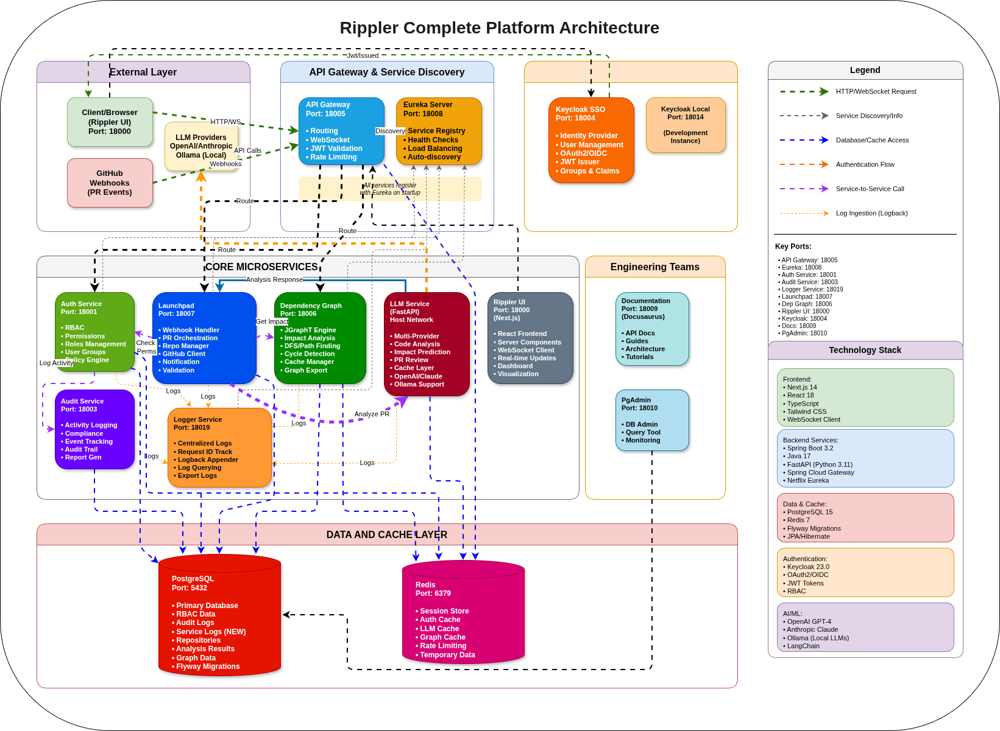

# 🌊 Rippler - Ripple Impact Prediction and Propagation Logging for Engineering Resilience

Rippler is a comprehensive, AI-powered PR impact analysis platform for microservice-based systems. It performs automated impact analysis on code changes, visualizes dependencies, and notifies stakeholders of potential downstream effects through intelligent automation.

## 🎯 What is Rippler?

Rippler helps engineering teams understand the impact of pull requests across complex microservice architectures. By leveraging LLM technology and dependency graph analysis, it:

- **Automatically analyzes** code changes in pull requests
- **Identifies** downstream services and dependencies that may be affected
- **Assesses risk** levels and provides actionable recommendations
- **Notifies stakeholders** automatically based on impact analysis
- **Visualizes** service dependencies in real-time
- **Integrates seamlessly** with GitHub via webhooks

Built as a distributed microservices platform with Spring Boot, Next.js, and Python, Rippler provides enterprise-grade scalability, security, and observability.

## Checkout Rippler Live!
- **Production Live**: [https://rippler.hanisntsolo.dev](https://rippler.hanisntsolo.dev)  
  (Register on Rippler and Check its capabilites.)
- **Documentation**: [https://rippler-docs.hanisntsolo.dev](https://rippler-docs.hanisntsolo.dev)

## 🏗️ Architecture

### System Architecture Diagram



**📊 [View Full Architecture Documentation](https://rippler-docs.hanisntsolo.dev)** |

The diagram above shows the complete Rippler system architecture including:

#### External Layer
- **Client/Browser**: Rippler UI (Next.js) on port 18000
- **GitHub Webhooks**: Real-time PR event notifications
- **LLM Providers**: OpenAI GPT-4, Anthropic Claude, Ollama (local)

#### API Gateway & Service Discovery Layer
- **API Gateway** (Port 18005): Single entry point with routing, authentication, and WebSocket support
- **Eureka Discovery Server** (Port 18008): Service registry with health monitoring and dynamic discovery

#### Authentication & Identity Layer
- **Keycloak SSO** (Port 18004): OAuth2/OIDC identity provider for authentication
- **Keycloak Local** (Port 18014): Development instance for local testing

#### Core Microservices Layer
- **Auth Service** (Port 18001): Role-Based Access Control (RBAC) and permission management
- **Audit Service** (Port 18011): Activity logging and audit trails
- **Launchpad Service** (Port 18007): Repository onboarding, GitHub webhook handler, and PR analysis orchestration
- **Dependency Graph Engine** (Port 18006): Service dependency graph analysis and impact calculation
- **LLM Service** (Port 18002): AI-powered code analysis using OpenAI, Claude, or local models

#### Presentation Layer
- **Rippler UI** (Port 18000): Next.js dashboard with real-time WebSocket updates

#### Data Layer
- **PostgreSQL** (Port 5432): Primary database for all services
- **Redis** (Port 6379): Caching and session management

#### Additional Components
- **pgAdmin** (Port 18009): Database administration interface
- **Documentation** (Port 18010): Static documentation site

### Project Structure

```bash
rippler/
├── services/                    # All microservices (as submodules)
│   ├── api-gateway/            # API Gateway with Spring Cloud Gateway
│   ├── auth-service/           # RBAC and permissions (Spring Boot)
│   ├── audit-service/          # Activity logging (Spring Boot)
│   ├── launchpad/             # Repository onboarding & webhook handler (Spring Boot)
│   ├── dependency-graph-engine/ # Graph analysis with JGraphT (Spring Boot)
│   ├── llm-service/           # LLM-based analysis (Python/FastAPI)
│   ├── discovery-server/      # Eureka service registry (Spring Boot)
│   └── rippler-ui/            # Next.js web interface (TypeScript/React)
├── shared/                     # Shared utilities and models
├── config/                     # Shared configuration
│   └── postgres/              # Database initialization scripts
├── docs/                       # Documentation
│   └── architecture/          # Architecture diagrams and documentation
├── website/                    # Documentation website
├── scripts/                    # Helper scripts
├── docker-compose.yml         # Production orchestration
├── docker-compose.dev.yml     # Development orchestration
├── docker-compose.prod.yml    # Production-specific configuration
└── Makefile                   # Build automation commands
```

## 🚀 Quick Start

### Prerequisites

Before starting, ensure you have the following installed:

- **Git** (2.x or higher)
- **Docker** (20.x or higher) and **Docker Compose** (v2.x or higher)
- **Make** (optional, but highly recommended for simplified commands)
- **Java 17** (if building services locally)
- **Maven 3.6+** (if building Java services locally)
- **Node.js 18+** and **npm** (if running UI locally)
- **Python 3.9+** (if running LLM service locally)

### Initial Setup

1. **Clone the repository with all submodules:**
```bash
git clone --recurse-submodules https://github.com/Citi-Rippler/rippler.git
cd rippler

# Or if you already cloned without submodules:
make init
# Or manually:
git submodule update --init --recursive
```

2. **Configure environment variables:**

The system requires several environment variables. Key services like the LLM service have their own `.env.example` files:

```bash
# For LLM Service (AI-powered analysis)
cd services/llm-service
cp .env.example .env
# Edit .env and add your API keys:
# - OPENAI_API_KEY for OpenAI GPT models
# - ANTHROPIC_API_KEY for Claude models
# - Or configure LOCAL_MODEL settings for Ollama

# For Rippler UI
cd ../rippler-ui
cp .env.example .env.local
# Configure API endpoints
```

Required environment variables for the main system (set in your shell or docker-compose):
- `POSTGRES_DB`, `POSTGRES_USER`, `POSTGRES_PASSWORD`: Database credentials
- `KEYCLOAK_ISSUER_URI`, `KEYCLOAK_JWK_SET_URI`: Keycloak configuration
- `EUREKA_USER`, `EUREKA_PASS`: Service discovery credentials

3. **Build and start all services:**

Using Make (recommended):
```bash
# Build all services
make build

# Start all services
make up

# Or combine both
make build up
```

Using Docker Compose directly:
```bash
# Build all services
docker-compose build

# Start all services
docker-compose up -d

# View logs
docker-compose logs -f
```

4. **Verify services are running:**

```bash
# Check service status
docker-compose ps

# Or use Make
make status

# View logs for all services
make logs

# View logs for specific service
docker-compose logs -f launchpad
```

5. **Access the application:**

Once all services are up and healthy (this may take 2-3 minutes), access:

- **Rippler UI**: http://localhost:18000 (Main dashboard)
- **API Gateway**: http://localhost:18005 (API entry point)
- **Eureka Dashboard**: http://localhost:18008 (Service registry)
- **Keycloak Admin**: http://localhost:18004 (Identity management)
- **pgAdmin**: http://localhost:18009 (Database admin)
- **Documentation**: http://localhost:18010 (API docs)

### Quick Command Reference

```bash
# Start services
make up                    # Start all services
make up-dev               # Start in development mode

# Build services
make build                # Build all services
make build-launchpad      # Build specific service

# View logs
make logs                 # All services
make logs-launchpad      # Specific service

# Stop services
make down                # Stop all services
make down-clean          # Stop and remove volumes

# Restart services
make restart             # Restart all
make restart-launchpad   # Restart specific service

# Development
make pull-main           # Pull latest changes with submodules
make submodule-status    # Check submodule status

# Testing
make test                # Run all tests
```

## 📦 Services Overview

Rippler consists of 8 core microservices, each with specific responsibilities:

### 🌐 API Gateway (Port 18005)
**Technology**: Spring Boot 3.1.5, Spring Cloud Gateway, Netflix Eureka

The unified entry point for all client requests, providing:
- HTTP/WebSocket routing to microservices
- JWT token validation with Keycloak integration
- Rate limiting and request transformation
- Dynamic service discovery via Eureka
- Cross-cutting concerns (logging, monitoring)
- Gateway routes automatically discovered from service registry

**Key Endpoints**:
- `/actuator/health` - Health check
- `/actuator/gateway/routes` - List all routes
- `/api/services` - Service management
- `/api/services/changes` - Service change history

📖 [API Gateway Documentation](services/api-gateway/README.md)

### 🔐 Auth Service (Port 18001)
**Technology**: Spring Boot 3.2, PostgreSQL, Redis

Centralized Role-Based Access Control (RBAC) and permission management:
- Role and permission management (create, list, assign)
- Principal (user/service account) management
- Role bindings with optional resource scoping
- Permission checks with Redis caching (10-minute TTL)
- Integration with Keycloak for JWT validation
- Resource pattern matching for fine-grained permissions

**Default Roles**: `reader`, `contributor`, `maintainer`, `admin`

**Default Permissions**: `impact:read`, `impact:run`, `notifications:send`, `graph:read`, etc.

**Key Endpoints**:
- `POST /api/v1/roles` - Create role
- `POST /api/v1/permissions` - Create permission
- `POST /api/v1/bindings` - Bind role to user
- `POST /api/v1/check` - Check permissions

📖 [Auth Service Documentation](services/auth-service/README.md)

### 📝 Audit Service (Port 18011)
**Technology**: Spring Boot 3.2, PostgreSQL

Centralized audit logging for security and compliance:
- Login event tracking
- Permission granted/denied events
- Query logs by principal, event type, or time range
- Pagination support for large datasets
- Indexed queries for fast retrieval
- Immutable audit logs for compliance

**Event Types**: `LOGIN`, `PERMISSION_GRANTED`, `PERMISSION_DENIED`, `LOGOUT`, `TOKEN_REFRESH`

**Key Endpoints**:
- `POST /api/v1/audit/login` - Log login event
- `POST /api/v1/audit/permissionGranted` - Log permission granted
- `POST /api/v1/audit/permissionDenied` - Log permission denied
- `GET /api/v1/audit/principal/{subject}` - Query by user
- `GET /api/v1/audit/timerange` - Query by time range

📖 [Audit Service Documentation](services/audit-service/README.md)

### 🚀 Launchpad Service (Port 18007)
**Technology**: Spring Boot 3.2, PostgreSQL, Flyway

Repository onboarding and webhook management hub:
- **GitHub Repository Search**: Search public repos via GitHub API
- **Repository Onboarding**: Register repos for monitoring with metadata
- **GitHub Webhook Handler**: Process PR events (opened, reopened, synchronized)
- **PR Analysis Orchestration**: Coordinate between graph engine and LLM service
- **GitHub Notifications**: Post analysis results back to PRs
- **Webhook Signature Validation**: HMAC-SHA256 verification
- **Metadata Management**: Store repo configuration and access tokens

**Key Endpoints**:
- `GET /api/v1/search/repositories?q={query}` - Search GitHub repos
- `POST /api/v1/repositories/github` - Onboard from search results
- `POST /api/v1/repositories` - Manual repository onboarding
- `GET /api/v1/repositories` - List onboarded repositories
- `POST /webhook/github` - GitHub PR webhook receiver
- `POST /api/v1/pr-analysis-results/send-notification` - Send PR notifications
- `GET /api/v1/pr-analysis-results` - Query analysis results

**Workflow**: Webhook → Validate → Fetch Dependencies → Analyze with LLM → Store Results → Post to GitHub

📖 [Launchpad Service Documentation](services/launchpad/README.md)

### 🕸️ Dependency Graph Engine (Port 18006)
**Technology**: Spring Boot 3.2, JGraphT, Redis

High-performance graph analysis for microservice dependencies:
- Real-time dependency graph (in-memory with JGraphT)
- Downstream dependency calculation with impact scores
- Circular dependency detection
- Redis caching for performance
- UI-friendly export formats for visualization
- Sub-second query times for 100+ services

**Key Endpoints**:
- `GET /api/v1/graph` - Complete dependency graph
- `GET /api/v1/graph/downstream/{service_id}` - Downstream analysis
- `GET /api/v1/graph/export` - Export for UI visualization
- `POST /api/v1/graph/refresh` - Refresh graph from registry
- `GET /api/v1/health` - Health check with graph status

**Algorithms**: DFS for traversal, cycle detection with JGraphT's `CycleDetector`

📖 [Dependency Graph Engine Documentation](services/dependency-graph-engine/README.md)

### 🤖 LLM Service (Port 18002)
**Technology**: Python 3.9+, FastAPI, OpenAI/Anthropic/Ollama

AI-powered impact analysis and report generation:
- **Multi-Provider Support**: OpenAI GPT-4o-mini, Anthropic Claude, Ollama (local)
- **Automatic Fallback**: Falls back to local models if remote APIs unavailable
- **Impact Analysis**: Detailed code change analysis with risk scoring
- **Risk Assessment**: Automated scoring (high, medium, low)
- **Stakeholder Identification**: Suggests teams to notify
- **Recommendations**: Actionable items based on changes
- **GPU Acceleration**: Supports CUDA/ROCm/Metal for local models
- **Performance**: Sub-10-second response for typical PRs
- **Structured Output**: JSON reports with confidence scores

**Supported Models**:
- OpenAI: `gpt-4o-mini`, `gpt-4`, `gpt-3.5-turbo`
- Anthropic: `claude-3-haiku`, `claude-3-sonnet`, `claude-3-opus`
- Ollama: `codellama:7b`, `codellama:13b`, `deepseek-coder:6.7b`

**Key Endpoint**:
- `POST /api/v1/analyze` - Analyze PR changes

**Environment Variables**:
- `LLM_PROVIDER`: `openai`, `anthropic`, or `local`
- `OPENAI_API_KEY`, `ANTHROPIC_API_KEY`: API credentials
- `LOCAL_MODEL_NAME`: Ollama model name
- `LOCAL_MODEL_GPU_LAYERS`: GPU acceleration setting
- `ENABLE_FALLBACK`: Automatic fallback to local models

📖 [LLM Service Documentation](services/llm-service/README.md)

### 🎨 Rippler UI (Port 18000)
**Technology**: Next.js 16, TypeScript, Tailwind CSS, React Flow

Modern web dashboard with real-time capabilities:
- **Real-time Updates**: WebSocket integration for live PR analysis tracking
- **Dependency Visualization**: Interactive graph with React Flow
- **Service Management**: Add, edit, delete service registry entries
- **Analysis Dashboard**: View all PR analyses with filtering
- **Analysis Details**: Deep dive into impact breakdown
- **Stakeholder Management**: Track reviewers and notifications
- **Responsive Design**: Mobile, tablet, and desktop support
- **Professional UI**: Clean design with Tailwind CSS

**Key Pages**:
- `/` - Dashboard with all PR analyses
- `/analysis/[id]` - Detailed analysis view
- `/services` - Service registry management
- `/graph` - Interactive dependency graph

**Technology Stack**:
- Framework: Next.js 16 with App Router
- State: Zustand
- API: Axios + socket.io-client
- Charts: Recharts

📖 [Rippler UI Documentation](services/rippler-ui/README.md)

### 🔍 Discovery Server (Port 18008)
**Technology**: Spring Boot 3.1.5, Netflix Eureka

Service registry for dynamic service discovery:
- Service registration and deregistration
- Health monitoring with heartbeats (30-second intervals)
- Dynamic route discovery for API Gateway
- Service metadata storage
- Dashboard for monitoring registered services
- Self-preservation mode for network partitions

**Key Features**:
- All microservices register on startup
- Automatic health checks and eviction
- Integration with API Gateway for routing
- Eureka REST API for service queries

📖 [Discovery Server Documentation](services/discovery-server/README.md)

### 🔐 Keycloak (Port 18004)
**Technology**: Keycloak 23.0

Enterprise identity and access management:
- OAuth2/OIDC authentication provider
- JWT token issuer and validator
- User and group management
- SSO (Single Sign-On) support
- Role and claim management
- Integration with all services for authentication

**Admin Console**: http://localhost:18004

**Development Instance**: Port 18014 (separate for local testing)

## 💾 Infrastructure Components

### PostgreSQL (Port 5432)
**Image**: postgres:15-alpine

Primary database for all services with separate databases:
- `rippler_auth` - Auth service data
- `rippler_audit` - Audit logs
- `rippler_launchpad` - Repository metadata and PR analysis
- `rippler_graph` - Dependency graph data
- Automatic initialization via `init-databases.sh`
- Health checks every 10 seconds
- Persistent volume at `/mnt/data/rippler/postgres_data`

**Admin Interface**: pgAdmin on port 18009

### Redis (Port 6379)
**Image**: redis:7-alpine

High-performance caching and session management:
- Permission check caching (10-minute TTL)
- Session storage for API Gateway
- Graph data caching
- Service discovery cache
- Health checks every 10 seconds
- Persistent volume for data

### Network
**Network**: `rippler-network` (bridge driver)

All services communicate through a Docker bridge network for isolation and service discovery.

## 🔄 Complete Workflow: From PR to Analysis

Here's how Rippler processes a pull request end-to-end:

1. **Developer creates/updates PR** on GitHub
2. **GitHub sends webhook** to Launchpad Service (`POST /webhook/github`)
3. **Launchpad validates** webhook signature (HMAC-SHA256)
4. **Launchpad fetches dependencies** from Dependency Graph Engine
5. **Launchpad sends analysis request** to LLM Service with PR diff and dependencies
6. **LLM Service analyzes** code changes using OpenAI/Claude/Ollama
7. **LLM Service returns** structured analysis with impact assessment
8. **Launchpad stores results** in PostgreSQL database
9. **Launchpad posts comment** to GitHub PR with analysis
10. **Rippler UI updates** in real-time via WebSocket
11. **Stakeholders receive notifications** based on impact level

## 🛠️ Development Workflow

### Working on a Specific Service

Each service is a Git submodule that can be developed independently:

```bash
# Navigate to the service
cd services/launchpad

# Work on the service independently
git checkout -b feature/new-analysis
# Make changes...
git add .
git commit -m "feat: add new analysis feature"
git push origin feature/new-analysis

# Go back to main repo
cd ../..

# Update the submodule reference
git add services/launchpad
git commit -m "chore: update launchpad submodule"
git push
```

### Building Services Locally

**Java Services** (API Gateway, Auth, Audit, Launchpad, Dependency Graph, Discovery Server):
```bash
cd services/launchpad
./mvnw clean package -DskipTests
# Or with Maven installed
mvn clean package -DskipTests
```

**Python Service** (LLM Service):
```bash
cd services/llm-service
pip install -r requirements.txt
python -m app.main
```

**UI Service** (Rippler UI):
```bash
cd services/rippler-ui
npm install
npm run dev
```

### Pulling Latest Changes

```bash
# Pull main repo and all submodules
make pull-main

# Or manually:
git pull
git submodule update --remote --merge
```

### Running Individual Services

```bash
# Run specific service with its dependencies
docker-compose up api-gateway launchpad postgres redis

# Or using Make for common workflows
make dev-api-gateway    # API Gateway with dependencies
make dev-launchpad      # Launchpad with dependencies

# View logs for specific service
docker-compose logs -f launchpad
make logs-launchpad
```

## 📦 Service Management

### Submodule Operations

```bash
# Check status of all submodules
make submodule-status
git submodule status

# Update all submodules to latest
git submodule update --remote --merge

# Update specific submodule
cd services/launchpad
git checkout main
git pull
cd ../..
git add services/launchpad
git commit -m "Update launchpad submodule"
```

### Service Control

```bash
# Restart specific service
docker-compose restart launchpad
make restart-launchpad

# Stop specific service
docker-compose stop launchpad

# Rebuild and restart service
docker-compose up -d --build launchpad

# Scale service (if supported)
docker-compose up -d --scale launchpad=3
```

### Health Checks

```bash
# Check all service health
docker-compose ps

# Check specific service health
curl http://localhost:18007/actuator/health  # Launchpad
curl http://localhost:18005/actuator/health  # API Gateway
curl http://localhost:18006/api/v1/health    # Graph Engine

# View service metrics
curl http://localhost:18007/actuator/metrics
```

## 🧪 Testing

### Running Tests

```bash
# Run all tests (if test infrastructure exists)
make test

# Test Java services
cd services/launchpad
./mvnw test
# Or with coverage
./mvnw test jacoco:report

# Test Python service (LLM)
cd services/llm-service
pytest
pytest --cov=app --cov-report=html

# Test UI
cd services/rippler-ui
npm test
npm run test:e2e
```

### Integration Testing

```bash
# Start test environment
docker-compose -f docker-compose.dev.yml up -d

# Run integration tests
# See docs/INTEGRATION_TESTING.md for details

# Cleanup
docker-compose -f docker-compose.dev.yml down
```

## 🎯 Key Features

### Core Capabilities
- ✅ **Real-time PR Impact Analysis**: Automated analysis on every PR event
- ✅ **AI-Powered Insights**: GPT-4, Claude, or local LLM analysis
- ✅ **Dependency Graph Analysis**: Visualize and query service dependencies
- ✅ **Risk Assessment**: Automated high/medium/low risk scoring
- ✅ **Stakeholder Identification**: Auto-detect affected teams
- ✅ **GitHub Integration**: Webhook-driven with automatic PR comments
- ✅ **Real-time Dashboard**: WebSocket-powered live updates
- ✅ **Enterprise Authentication**: Keycloak SSO with RBAC
- ✅ **Audit Logging**: Complete audit trail for compliance
- ✅ **Microservices Architecture**: Scalable, resilient, distributed

### Technical Features
- 🔐 **Security**: JWT authentication, RBAC, encrypted secrets
- 📊 **Observability**: Distributed tracing, health checks, metrics
- 🚀 **Performance**: Redis caching, sub-second graph queries
- 🔄 **Resilience**: Health checks, auto-restart, circuit breakers
- 📦 **Containerization**: Full Docker support with compose orchestration
- 🌐 **Service Discovery**: Eureka-based dynamic service registration
- 🔍 **API Gateway**: Single entry point with routing and rate limiting

## 🔧 Configuration

### Environment Variables

Key environment variables across services:

**Database (PostgreSQL)**:
```bash
POSTGRES_DB=rippler
POSTGRES_USER=postgres
POSTGRES_PASSWORD=your_password
```

**Keycloak (SSO)**:
```bash
KEYCLOAK_ISSUER_URI=http://keycloak:8080/realms/rippler
KEYCLOAK_JWK_SET_URI=http://keycloak:8080/realms/rippler/protocol/openid-connect/certs
```

**Service Discovery (Eureka)**:
```bash
EUREKA_SERVER_URL=http://discovery-server:8761/eureka/
EUREKA_USER=admin
EUREKA_PASS=admin
```

**LLM Service**:
```bash
LLM_PROVIDER=openai  # or anthropic, local
OPENAI_API_KEY=your_key
LOCAL_MODEL_NAME=codellama:7b
ENABLE_FALLBACK=true
```

**GitHub Integration**:
```bash
GITHUB_TOKEN=ghp_xxxxxxxxxxxx
WEBHOOK_SECRET=your_secret_key
```

### Service Ports Reference

| Service | Internal Port | External Port | Description |
|---------|--------------|---------------|-------------|
| Rippler UI | 3000 | 18000 | Web dashboard |
| Auth Service | 8080 | 18001 | RBAC & permissions |
| LLM Service | 8000 | 18002 | AI analysis |
| Keycloak | 8080 | 18004 | SSO & identity |
| API Gateway | 8080 | 18005 | API entry point |
| Dependency Graph | 8080 | 18006 | Graph engine |
| Launchpad | 8080 | 18007 | Webhook handler |
| Discovery Server | 8761 | 18008 | Service registry |
| pgAdmin | 80 | 18009 | DB admin |
| Documentation | 3000 | 18010 | API docs |
| Audit Service | 8080 | 18011 | Audit logging |
| Keycloak Local | 8080 | 18014 | Dev Keycloak |
| PostgreSQL | 5432 | 5432 | Database |
| Redis | 6379 | 6379 | Cache |

## 👥 Team Collaboration

### For Team Members

1. **First time setup:**
```bash
git clone --recurse-submodules https://github.com/Citi-Rippler/rippler.git
cd rippler
make init
```

2. **Daily workflow:**
```bash
# Update everything
make pull-main

# Work on your service
cd services/launchpad
git checkout -b feature/your-feature
# ... make changes ...
git push origin feature/your-feature

# Create PR in the service repo
```

3. **After your service PR is merged:**
```bash
# Update main repo to reference new commit
cd rippler
git submodule update --remote services/launchpad
git add services/launchpad
git commit -m "chore: update launchpad to v1.2.3"
git push
```

### Best Practices

- **One service, one PR**: Keep changes focused on a single service
- **Update submodule references**: Always update the main repo after merging service PRs
- **Test locally**: Build and test before pushing
- **Use conventional commits**: `feat:`, `fix:`, `chore:`, etc.
- **Document changes**: Update service README when adding features

## 🔍 Troubleshooting

### Common Issues

**Services not starting**:
```bash
# Check service logs
docker-compose logs [service-name]

# Restart specific service
docker-compose restart [service-name]

# Clean restart
docker-compose down
docker-compose up -d
```

**Database connection issues**:
```bash
# Check PostgreSQL health
docker-compose exec postgres pg_isready

# Check database exists
docker-compose exec postgres psql -U postgres -l

# Restart database
docker-compose restart postgres
```

**Submodule sync issues**:
```bash
# Reset submodules
git submodule deinit -f .
git submodule update --init --recursive

# Force update
git submodule foreach git reset --hard
git submodule update --remote --merge
```

**Build failures**:
```bash
# Clean build
make clean
make build

# Rebuild specific service
docker-compose build --no-cache launchpad
```

**Port conflicts**:
```bash
# Check what's using the port
lsof -i :18007
netstat -tulpn | grep 18007

# Stop conflicting service or change port in docker-compose.yml
```

**Keycloak not accessible**:
```bash
# Wait for Keycloak to fully start (can take 30-60 seconds)
docker-compose logs -f keycloak

# Check health
curl http://localhost:18004/health
```

**LLM Service errors**:
```bash
# Check API keys are set
cd services/llm-service
cat .env

# Test with local model instead
export LLM_PROVIDER=local
export LOCAL_MODEL_NAME=codellama:7b
```

### Performance Optimization

**Slow builds**:
- Use `make build` for incremental builds (SHA-based caching)
- Build only changed services: `docker-compose build launchpad`
- Increase Docker resources (memory, CPU) in Docker Desktop

**Slow queries**:
- Check PostgreSQL indexes
- Monitor Redis cache hit rate
- Review query logs in service outputs

**High memory usage**:
- Reduce number of running services
- Adjust JVM heap size for Java services
- Use development compose file: `docker-compose -f docker-compose.dev.yml up`

## 🚀 Deployment

### Production Deployment

```bash
# Use production compose file
docker-compose -f docker-compose.prod.yml up -d

# Or with Make
make up-prod
```

**Production checklist**:
- [ ] Set strong passwords for all services
- [ ] Configure SSL/TLS certificates
- [ ] Set up proper backup strategy
- [ ] Configure monitoring and alerting
- [ ] Review and harden Keycloak configuration
- [ ] Set resource limits in docker-compose
- [ ] Configure log rotation
- [ ] Set up reverse proxy (nginx/traefik)

### Monitoring

**Health checks**:
```bash
# Check all services
curl http://localhost:18005/actuator/health  # API Gateway
curl http://localhost:18007/actuator/health  # Launchpad
curl http://localhost:18006/api/v1/health    # Graph Engine
curl http://localhost:18001/actuator/health  # Auth Service
curl http://localhost:18011/actuator/health  # Audit Service
```

**Metrics**:
```bash
# Service metrics
curl http://localhost:18005/actuator/metrics

# Prometheus endpoint (if configured)
curl http://localhost:18005/actuator/prometheus
```

**Logs**:
```bash
# All services
docker-compose logs -f

# Specific service with tail
docker-compose logs -f --tail=100 launchpad

# Export logs
docker-compose logs > rippler-logs.txt
```

## 📚 Documentation

### Architecture & Design
- [Complete Platform Architecture](docs/architecture/COMPLETE_PLATFORM_ARCHITECTURE.md) - **Comprehensive system architecture with all services**
- [System Architecture](docs/architecture/README.md) - Architecture diagrams and documentation
- [Architecture Overview](docs/architecture.md) - High-level system design
- [Request ID Tracing](docs/REQUEST_ID_TRACING.md) - Distributed tracing implementation

### Setup & Configuration
- [Docker Setup Guide](docs/DOCKER_SETUP.md) - Docker and Docker Compose setup
- [Keycloak JWT Integration](docs/KEYCLOAK_JWT_INTEGRATION.md) - SSO authentication setup
- [SSO & RBAC Setup](docs/SSO_RBAC_SETUP.md) - Complete authentication and authorization guide

### Development
- [Getting Started](docs/getting-started.md) - Quick start for developers
- [Contribution Guide](docs/contribution-guide.md) - How to contribute
- [Integration Testing](docs/INTEGRATION_TESTING.md) - Testing microservices
- [FAQ](docs/faq.md) - Frequently asked questions

### Service Documentation
- [API Gateway](services/api-gateway/README.md) - Gateway and service discovery
- [Auth Service](services/auth-service/README.md) - RBAC and permissions
- [Audit Service](services/audit-service/README.md) - Audit logging
- [Launchpad Service](services/launchpad/README.md) - Repository onboarding and webhooks
- [Dependency Graph Engine](services/dependency-graph-engine/README.md) - Graph analysis
- [LLM Service](services/llm-service/README.md) - AI-powered analysis
- [Rippler UI](services/rippler-ui/README.md) - Web dashboard
- [Discovery Server](services/discovery-server/README.md) - Service registry

### Demo & Presentation
- [Quick Start Guide](docs/DEMO_VIDEO_QUICKSTART.md) - **3-step guide to record your demo**
- [Complete Demo Script](DEMO_VIDEO_SCRIPT.md) - **Full 5-minute demo video script**
- [Production Resources](docs/DEMO_VIDEO_RESOURCES.md) - Recording tips and workflow
- [Presentation README](PRESENTATION_README.md) - Presentation materials

### Additional Resources
- [Quick Reference](docs/quick-reference.md) - Common commands and patterns
- [Security](Security.md) - Security best practices
- [Code of Conduct](CODE_OF_CONDUCT.md) - Community guidelines
- [Contributing](CONTRIBUTING.md) - Contribution guidelines
- [Changelog](CHANGELOG.md) - Version history

## 🤝 Contributing

We welcome contributions to Rippler! Here's how you can help:

### Getting Started

1. **Fork the repository** you want to work on (main repo or specific service)
2. **Clone your fork** with submodules:
   ```bash
   git clone --recurse-submodules https://github.com/YOUR_USERNAME/rippler.git
   ```
3. **Create a feature branch**:
   ```bash
   git checkout -b feature/amazing-feature
   ```
4. **Make your changes** following our coding standards
5. **Test your changes** thoroughly
6. **Commit with conventional commits**:
   ```bash
   git commit -m "feat: add amazing feature"
   ```
7. **Push to your fork**:
   ```bash
   git push origin feature/amazing-feature
   ```
8. **Submit a Pull Request** with a clear description

### Contribution Areas

- **Features**: Add new capabilities to existing services
- **Bug fixes**: Fix issues and improve stability
- **Documentation**: Improve guides, READMEs, and examples
- **Testing**: Add unit tests, integration tests, or E2E tests
- **Performance**: Optimize queries, caching, or algorithms
- **Infrastructure**: Improve Docker setup, CI/CD, or monitoring

### Development Guidelines

- Follow existing code style and patterns
- Write meaningful commit messages using [Conventional Commits](https://www.conventionalcommits.org/)
- Add tests for new features
- Update documentation when changing behavior
- Keep PRs focused on a single concern
- Respond to code review feedback promptly

### Code Review Process

1. **Automated checks**: CI/CD runs linting, tests, and builds
2. **Code review**: Maintainers review your PR
3. **Iterations**: Address feedback and push updates
4. **Approval**: PR is approved by maintainers
5. **Merge**: Maintainers merge the PR
6. **Submodule update**: Main repo is updated to reference the new commit

For detailed guidelines, see [CONTRIBUTING.md](CONTRIBUTING.md) and [Contribution Guide](docs/contribution-guide.md).

## 📜 License

This project is licensed under the MIT License - see the [LICENSE](LICENSE) file for details.

## 📧 Team & Contact

### Core Team

**Dhirendra Pratap Singh** - Project Lead
**Devyani Kumrawat** - Developer
**Yogesh Dixit** - Developer
**Vaishnavi Mishra** - Developer

### Links

- **Project Repository**: [https://github.com/hanisntsolo/rippler](https://github.com/hanisntsolo/rippler)
- **Organization**: [https://github.com/Citi-Rippler](https://github.com/Citi-Rippler)
- **Issue Tracker**: [https://github.com/hanisntsolo/rippler/issues](https://github.com/hanisntsolo/rippler/issues)

### Support

- 📖 Check the [Documentation](docs/) for guides and references
- 🐛 Report bugs via [GitHub Issues](https://github.com/hanisntsolo/rippler/issues)
- 💬 Ask questions in [Discussions](https://github.com/hanisntsolo/rippler/discussions)
- 📧 Contact the team for security concerns

## 🙏 Acknowledgments

Built with:
- **Spring Boot 3.x** - Enterprise Java framework
- **Spring Cloud Gateway** - API Gateway
- **Netflix Eureka** - Service discovery
- **Next.js 16** - React framework
- **FastAPI** - Python web framework
- **Keycloak** - Identity and access management
- **PostgreSQL** - Relational database
- **Redis** - In-memory data store
- **JGraphT** - Graph algorithms
- **OpenAI API** - GPT models
- **Anthropic API** - Claude models
- **Ollama** - Local LLM runtime

Special thanks to the open-source community for these amazing tools and libraries.

---

**⭐ If you find Rippler useful, please give it a star on GitHub!**

Made with ❤️ by the Rippler Team
